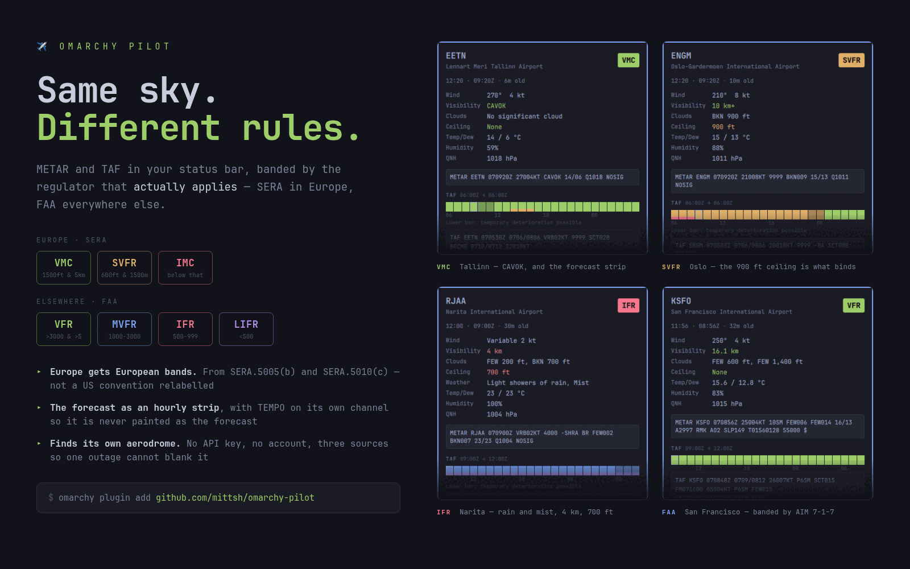
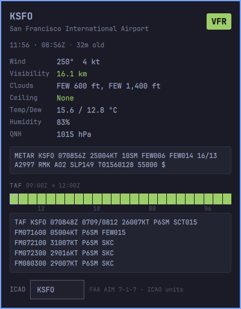
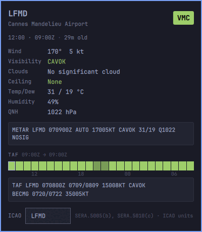
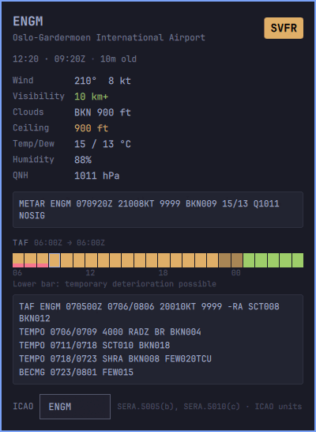
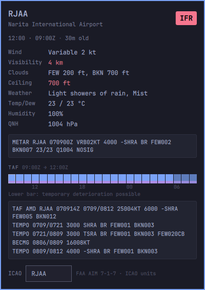
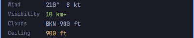
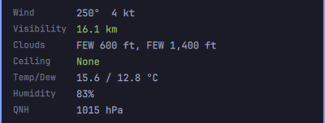
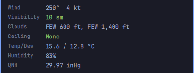
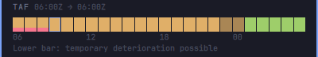

# Omarchy Pilot



Aviation weather for the [Omarchy](https://omarchy.org/) status bar. One
aerodrome: its METAR, its TAF, and a conditions band.


The bar pill shows the ICAO code and the band. Click it for the decoded
report, the raw METAR, an hour-by-hour forecast strip, and the raw TAF.


Every screenshot on this page is the real panel, showing the weather that was
actually reported at the moment it was taken.

### Four more aerodromes

<table>
<tr>
<td width="50%"></td>
<td width="50%"></td>
</tr>
<tr>
<td valign="top"><b>KSFO</b> — San Francisco. The United States, so the FAA
bands: <b>VFR</b>, MVFR, IFR, LIFR, and the footer cites AIM 7-1-7.</td>
<td valign="top"><b>LFMD</b> — Cannes Mandelieu. Europe, so the SERA bands:
<b>VMC</b>, SVFR, IMC, and the footer cites the two SERA gates.</td>
</tr>
<tr>
<td width="50%"></td>
<td width="50%"></td>
</tr>
<tr>
<td valign="top"><b>ENGM</b> — Oslo Gardermoen, <b>SVFR</b>. Visibility is
10 km+ and green; the 900 ft ceiling is what puts the aerodrome out of VMC,
and only that row turns amber.</td>
<td valign="top"><b>RJAA</b> — Narita, <b>IFR</b>. 4 km and a 700 ft ceiling
in rain and mist, with a forecast strip that stays MVFR blue all period.</td>
</tr>
</table>

## Install

```bash
omarchy plugin add https://github.com/mittsh/omarchy-pilot.git --enable
```

Then pick an aerodrome, or let it find the nearest one:

```bash
omarchy bar set mittsh.omarchy-pilot icao EETN    # a specific aerodrome
omarchy bar set mittsh.omarchy-pilot icao auto    # the nearest one
```

`auto` resolves once and writes the code it found back into your config, so
the lookup never repeats and you can see and change what it chose.

## Update and removal

```bash
omarchy plugin update mittsh.omarchy-pilot     # pull the latest version
omarchy plugin remove mittsh.omarchy-pilot     # uninstall it completely
```

Removing the plugin takes it off the bar and deletes
`~/.config/omarchy/plugins/mittsh.omarchy-pilot/`. Your settings live in the widget's
entry in `~/.config/omarchy/shell.json`, which Omarchy tidies up with it.

The plugin writes nothing outside those two places, keeps no cache and no
state file, and installs nothing system-wide.

## Settings

Set with `omarchy bar set mittsh.omarchy-pilot <key> <value>`, or edit the widget's
entry in `~/.config/omarchy/shell.json`. The ICAO field in the panel writes
to the same place.

| Key | Default | Meaning |
|---|---|---|
| `icao` | — | A 4-letter ICAO code, or `auto` for the nearest aerodrome. Unset shows a prompt and contacts nothing |
| `refreshMinutes` | `10` | How often to fetch |
| `rules` | `auto` | `auto`, `sera` or `faa`. See below |
| `units` | `icao` | `icao`, `metric` or `us`. See below |
| `labels` | `vmc` | `vmc` or `vfr`, the wording of the European bands |
| `lat`, `lon` | — | Your position, if you would rather not be located automatically |

## Conditions bands

   

**In Europe there is no equivalent of MVFR and LIFR.** A full-text search of
the EASA Easy Access Rules for SERA — the consolidated Regulation (EU)
923/2012 — finds zero occurrences of either. They are a US charting
convention, and FAA AC 00-45H says they are not flight rules even there.

So the plugin uses the rule set the aerodrome's regulator actually applies,
chosen by its ISO country.

**Europe and the United Kingdom** get three bands from the two SERA gates
that apply at an aerodrome and can be computed from a METAR:

| Band | Ceiling | Visibility | Source |
|---|---|---|---|
| **VMC** | at or above 1500 ft | **and** at or above 5 km | SERA.5005(b) |
| **SVFR** | at or above 600 ft | **and** at or above 1500 m | SERA.5010(c) |
| **IMC** | below that | below that | under the Special VFR floor |

**Everywhere else** gets the FAA bands from AIM 7-1-7, verbatim:

| Band | Ceiling | Visibility |
|---|---|---|
| VFR | over 3000 ft | **and** over 5 sm |
| MVFR | 1000 to 3000 ft | **or** 3 to 5 sm inclusive |
| IFR | 500 to under 1000 ft | **or** 1 to under 3 sm |
| LIFR | under 500 ft | **or** under 1 mile |

Either way the worse of ceiling and visibility wins, and the visibility and
ceiling rows are coloured by their own band, so you can see which of the two
is binding.



Oslo above is the case: the visibility is fine on its own, the ceiling is
not, and the aerodrome takes the ceiling's band.

Set `rules` to `sera` or `faa` to override the country.

The label describes **conditions**, not flight rules. It is not a clearance.

### Wording

`labels` chooses how the European bands are printed. **VMC** and **IMC** are
the terms European regulation actually uses, and are the default. **VFR** and
**IFR** are what most pilots say out loud.

```bash
omarchy bar set mittsh.omarchy-pilot labels vfr
```

| `labels` | Good | Marginal | Bad |
|---|---|---|---|
| `vmc` (default) | VMC | SVFR | IMC |
| `vfr` | VFR | SVFR | IFR |

 

The same aerodrome and the same report, under `labels vmc` and `labels vfr`.

The thresholds are identical either way — only the wording changes. The FAA
bands read the same under both, because VFR, MVFR, IFR and LIFR are already
the spoken terms.

## Units

```bash
omarchy bar set mittsh.omarchy-pilot units metric
```

| Preset | Wind | Visibility | Pressure | Temperature | Cloud height |
|---|---|---|---|---|---|
| **`icao`** (default) | kt | km | hPa | °C | ft |
| `metric` | **m/s** | km | hPa | °C | ft |
| `us` | kt | **sm** | **inHg** | °C | ft |

<table>
<tr>
<td width="50%"></td>
<td width="50%"></td>
</tr>
<tr>
<td align="center"><code>units icao</code></td>
<td align="center"><code>units us</code></td>
</tr>
</table>

The same KSFO report either way. It was filed as `10SM` and `A2997`, so the
`us` column is what the observer sent and the `icao` column is the
conversion. Only the two rows that carry a converted unit move.

Only the decoded rows follow the preset. **The raw METAR and TAF are always
quoted verbatim**, so the reported figure is one line away if a conversion
looks surprising.

Three things are worth knowing about these:

**`icao` is the international convention, not strict SI.** ICAO Annex 5 makes
the metre per second primary for wind speed and the metre primary for height,
with the knot and the foot as permitted alternatives — and Table 4-1 sets no
termination date for either, 45 years and counting. Nearly every state reports
in knots, so that is the default.

**`metric` differs from `icao` in one field only: the wind.** It uses the SI
primary, m/s, which is what Russia, China, Mongolia and Kazakhstan actually
report — the `MPS` suffix in a raw METAR. Note this is not a former-Soviet
pattern: Azerbaijan, Georgia and Armenia all report knots.

**Cloud height is feet in all three, deliberately.** Annex 5 makes the metre
primary for height, but no METAR anywhere encodes cloud that way: the code
form carries a `KT`/`MPS` indicator for wind and has no metric option at all
for the cloud group. Every m/s-reporting state still sends hundreds of feet.
Metres for cloud base exist only in Russian domestic minima, which is a
different document from the METAR.

Temperature is Celsius everywhere. Aviation has no Fahrenheit convention —
even US METARs report Celsius.

For completeness: the `us` set is a national deviation filed under Convention
Article 38, not an ICAO alternative. Statute miles and inches of mercury
appear nowhere in Annex 5's operative tables.

### UNKN

`UNKN` is a real answer, not a failure. It appears when the report cannot
support a band:

- The ceiling cannot be measured, such as `BKN///` in fog. Reading `///` as a
  zero base would report the worst possible category from data that says
  nothing.
- There is no cloud group at all. An observer who sees a clear sky sends
  `SKC` or `NSC`, so silence means the group is missing.
- The report is over three hours old. A stale METAR looks exactly like a
  fresh one.
- The aerodrome is not in the bundled table, so no regulator can be chosen.

## The forecast strip

One block per hour of the TAF validity period, coloured by the band that hour
is forecast to be in.



A TAF is a baseline plus amendments, and the three amendment types behave
differently:

| Group | Effect on the baseline | Drawn as |
|---|---|---|
| `FM` | Replaces it entirely, from that minute | The block colour changes |
| `BECMG` | Replaces only what it names, after the window ends | Colour changes; the window is dimmed |
| `TEMPO`, `PROB` | **Never** replaces it | A separate lower bar |

A temporary deterioration gets its own channel rather than the block colour.
Painting a `TEMPO` as the forecast would overstate it; hiding it would
understate it.

Inside a `BECMG` window the worse of the two is shown and the block is
dimmed, because either may be found there.

Oslo above shows all three at once: a `TEMPO` in the first hours on the lower
bar, a dimmed `BECMG` window in the middle, and the improvement to green that
the `BECMG` brings once its window has passed.

## Where the data comes from

Three sources, tried in order. All are free, need no key, and return raw
text. A source that answers with nothing falls through to the next, so an
outage at one does not blank the panel.

| Source | Notes |
|---|---|
| [aviationweather.gov](https://aviationweather.gov/data/api/) | NOAA. One request returns both products |
| [tgftp.nws.noaa.gov](https://www.weather.gov/tg/datahelp) | NOAA static files, a different host and stack |
| [api.met.no](https://api.met.no/) | Weather data from MET Norway, [CC BY 4.0](https://creativecommons.org/licenses/by/4.0/) |

The bundled aerodrome table is built from the NOAA station cache joined to
[OurAirports](https://ourairports.com/data/), both public domain. It holds
every METAR-reporting station with its country, name and position, so the
plugin needs no network call to choose a rule set, name an aerodrome, or find
the nearest one.

Regenerate it with `node dev/build-stations.js`. Monthly is plenty.

### Your position

`icao auto` needs to know roughly where you are. It tries, in order:

1. `lat` and `lon`, if you set them.
2. The location the Omarchy weather plugin already stores. No new request and
   no new service.
3. `ipapi.co`, which locates you from your IP address.

Only step 3 leaves your machine. It runs **only** when you have explicitly
set `icao` to `auto`, and only until a code has been resolved — after which
the code is written to your config and the lookup never repeats.

**Leaving `icao` unset is not the same as `auto`.** An unset code shows a
prompt and contacts no geolocation service at all, so enabling the widget
without configuring it never locates you. Set `lat` and `lon` to use `auto`
without any lookup.

## Development

```bash
dev/sync.sh              # after a .qml change
dev/sync.sh --restart    # after a .js change
tests/all.sh             # unit tests, manifest validation, qmllint
```

`dev/sync.sh` copies the working tree into `~/.config/omarchy/plugins/`. It
copies rather than links, because the plugin validator refuses a symlink
anywhere inside a plugin folder.

**A `.js` change needs `--restart`.** The shell's plugin rescan clears the QML
component cache but not the JavaScript resource cache.

All decoding lives in plain `.js` files with no QML types and no clock of
their own — the caller passes the time in. They run under `node`, so the
tests are fast and deterministic.

Design notes and the reasoning behind each decision are in
[docs/PLAN.md](docs/PLAN.md).

## Credits

The panel's presentation follows [metar-taf.com](https://metar-taf.com/),
reduced to what fits a status-bar popup: the conditions badge, the
observation age as a first-class field, per-field colouring of visibility and
ceiling, and the hour-by-hour forecast strip. Several strings are theirs
verbatim, because they are hard to improve on — `10 km+`, `None`,
`310° (270-360°)`.

## Licence

MIT. See [LICENSE](LICENSE).
